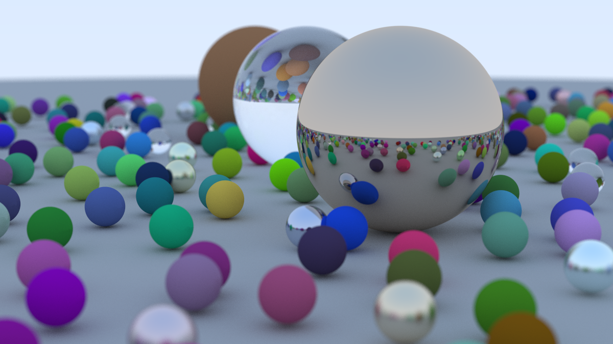

a simple raytracer (path tracer) written in rust

### usage
```bash
cargo run > image.ppm
```

### gallery


### reference
- [raytracing in one weekend](https://raytracing.github.io/books/RayTracingInOneWeekend.html)
